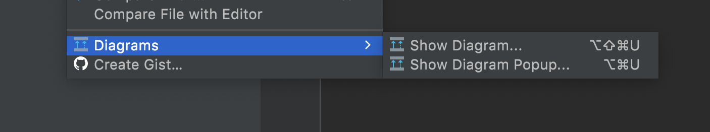
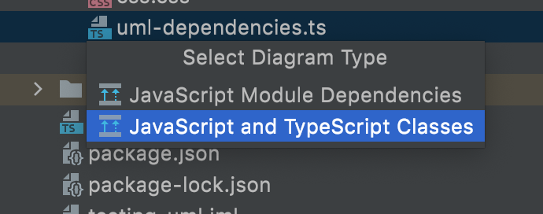
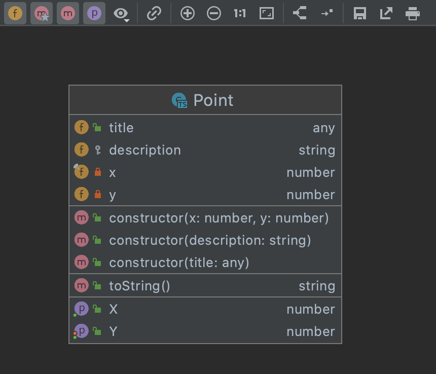
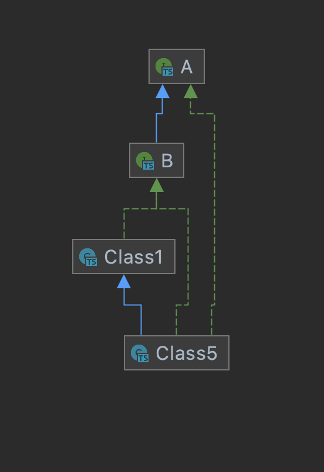
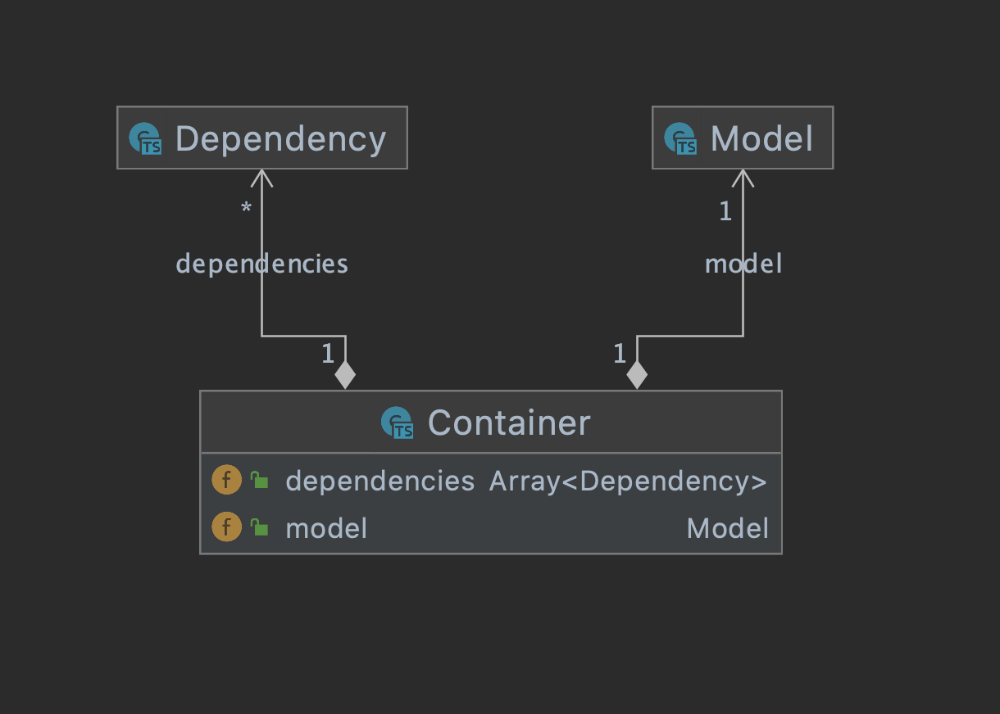
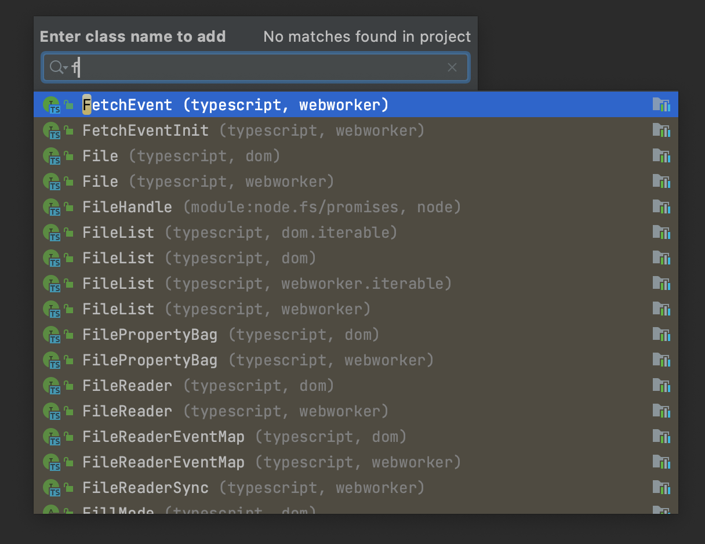
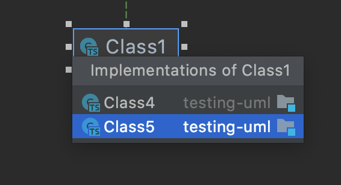
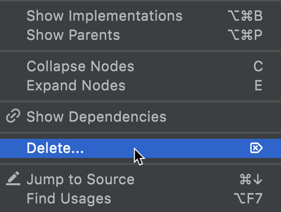

# UML Diagrams IntelliJ Plugin for JavaScript and TypeScript

Provides support for UML class diagrams in IntelliJ-based IDEs for **JavaScript** and **Typescript** languages.

## Usage

It's possible to create a diagram from a single class or an interface, 
a JavaScript or a TypeScript file and from a directory. To access a diagram you could use an item called `Diagrams`
in a context menu, and then select a `JavaScript and TypeScript Classes` diagram type. 
| Context menu | Diagram type |
| ----------- | ----------- |
|  |  |

## Features

### Class structure:

### Relationships:

### Dependencies:

### Diagram editing:

Open the context menu to take advantage of the chart editing features.

1. Select and add a class, interface or enum to the diagram.

2. Add implementations or parents of the selected node.

3. Remove selected nodes.

