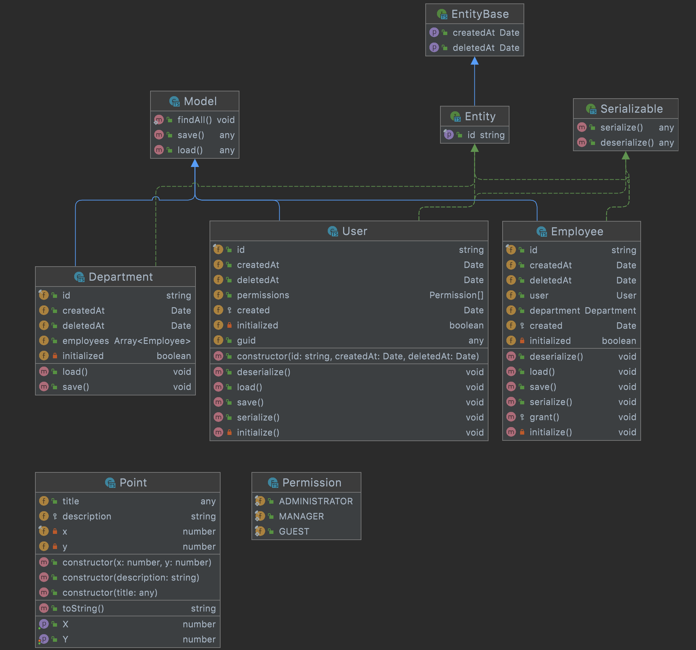

# UML Diagrams IntelliJ Plugin for JavaScript and TypeScript

Provides support for UML class diagrams in IntelliJ-based IDEs for **JavaScript** and **TypeScript** languages.
The following features are available:

* Support for JS and TS classes, interfaces and enums.
* Class members structure view with respect to the latest JS and TS standards.
* Diagrams editing: adding and removing nodes, drag-and-drop support.
* Show parents and implementations.

## Usage:

It's possible to build a diagram from a single class or an interface,
a JavaScript or a TypeScript file and from a whole directory.
To create a diagram you could use an item called **Diagrams** in a context menu,
and then select a **JavaScript and TypeScript Classes** diagram type.

More details could be found in the IntelliJ diagrams [docs](https://www.jetbrains.com/help/idea/class-diagram.html).
